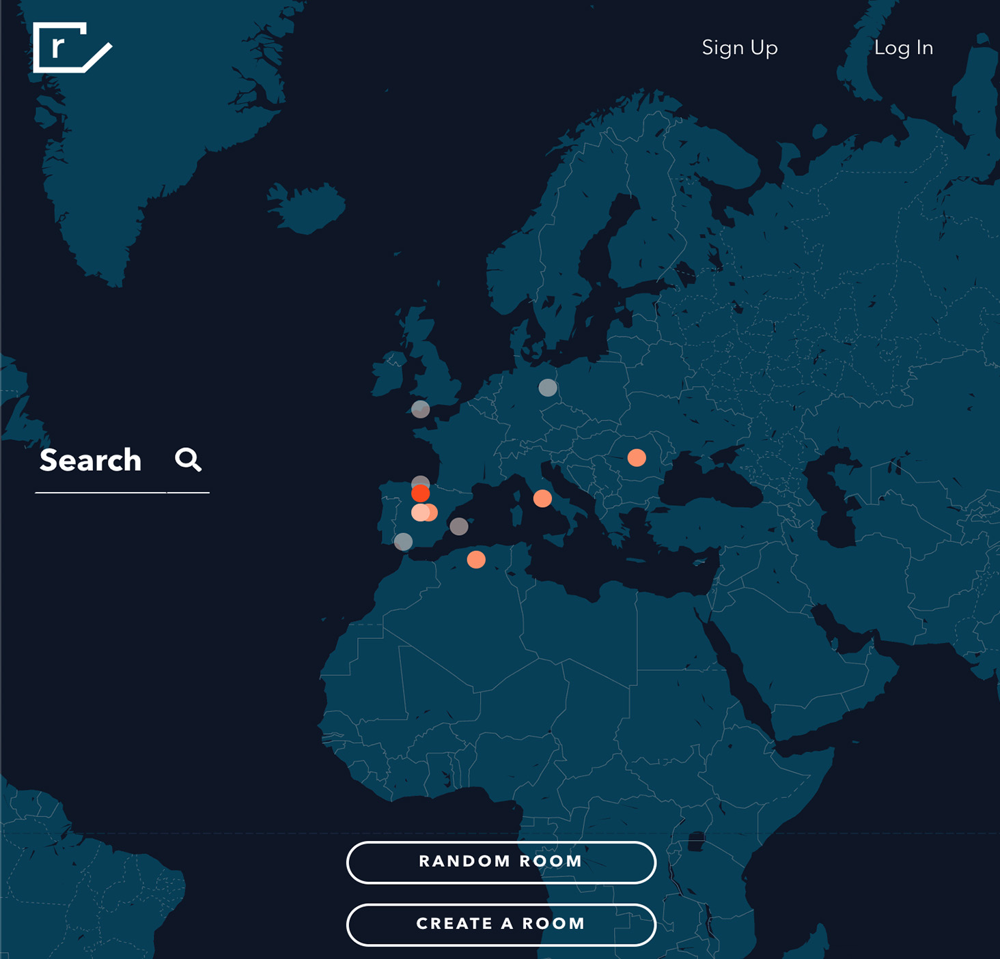
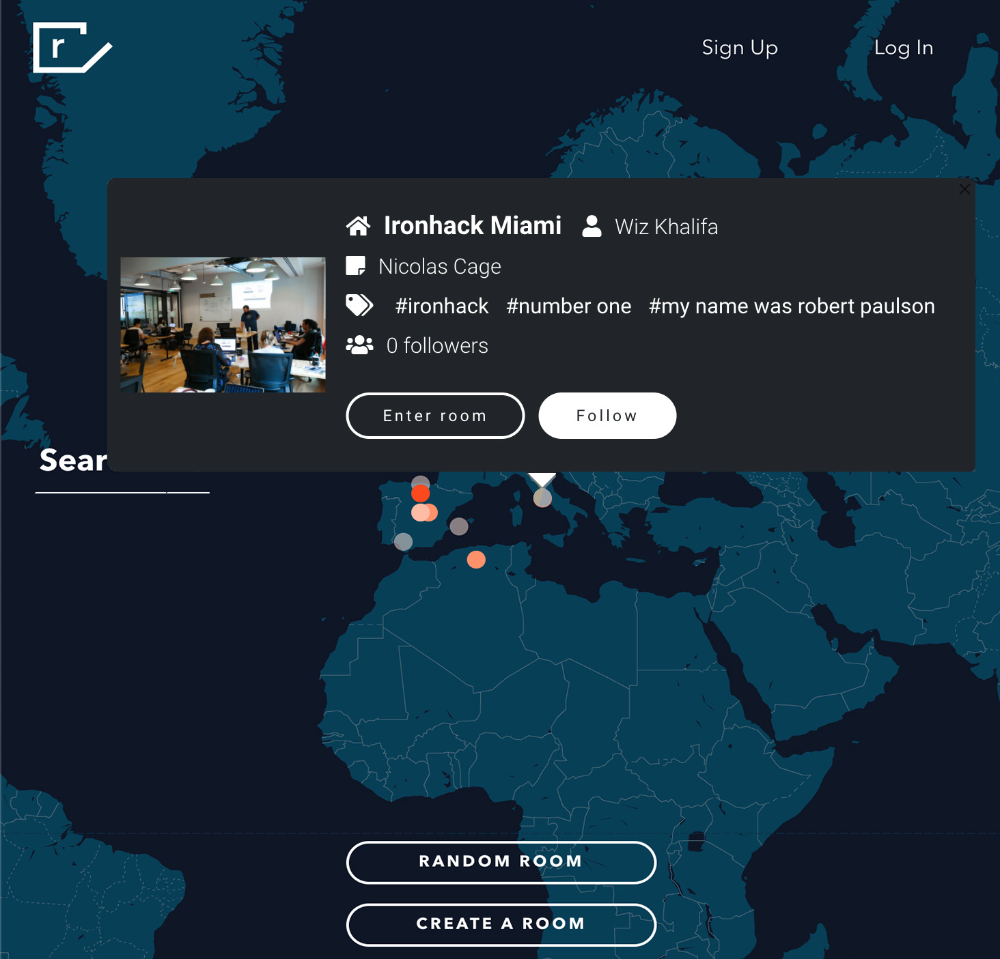
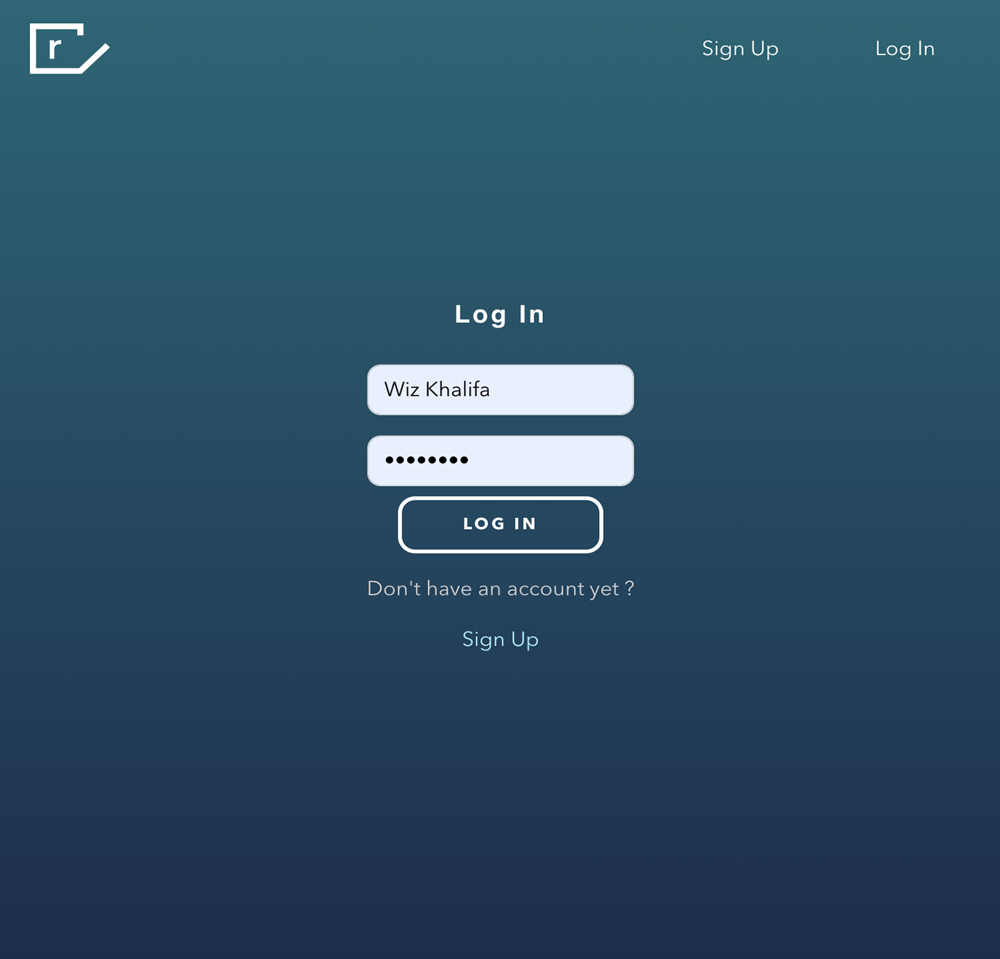
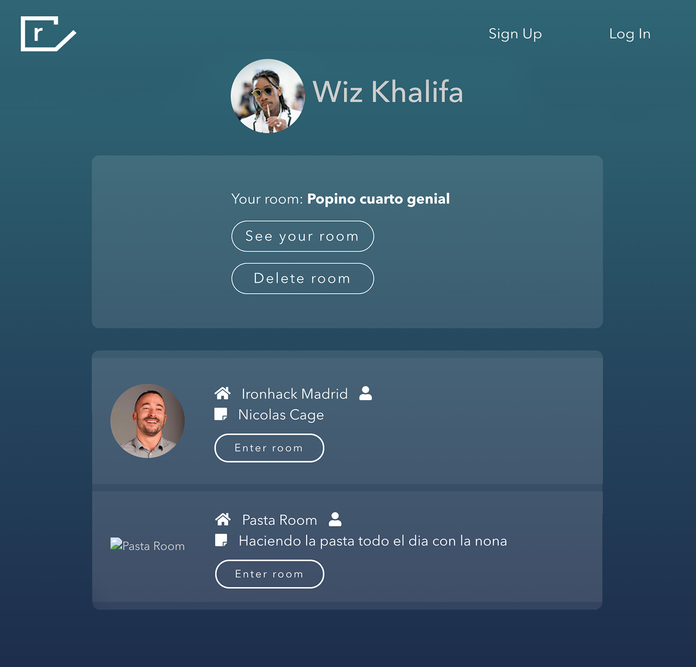
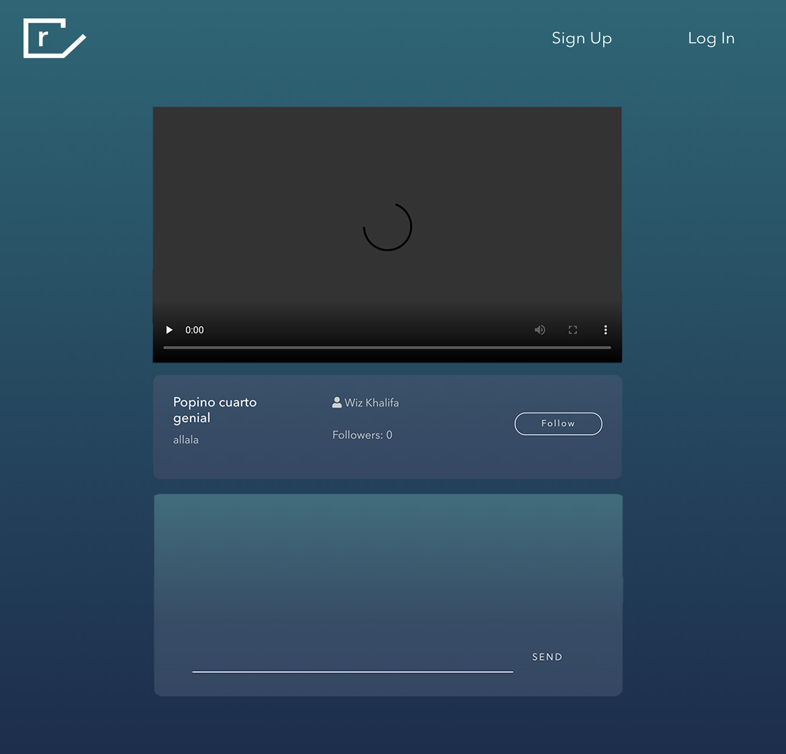

# Rooms – Social Streaming Platform

A MERN stack social media application that allows users to stream live video from their rooms and watch streams from people around the world. This project demonstrates full-stack development, real-time video streaming, authentication, and responsive UI design.

## Overview

Rooms is a social media platform where users can create personal streaming rooms, broadcast live video, and watch streams from other users globally. Viewers can interact through chat, follow favorite streamers, and explore streams via an interactive world map. This project highlights real-time streaming, user authentication, and full-stack integration using modern JavaScript technologies.

## Features

- User registration and login with JWT authentication
- Create and manage personal streaming rooms
- Watch live streams from other users worldwide
- Real-time chat in each streaming room
- Follow and discover streamers
- Explore streams using an interactive world map
- Responsive UI built with React and CSS
- Backend with Node.js + Express + MongoDB
- Basic unit tests for key backend routes and React components

## Tech Stack

- Frontend: React, JavaScript, CSS
- Backend: Node.js, Express
- Database: MongoDB
- Authentication: JWT
- Real-time Communication: Socket.io
- Interactive Map: Google Maps

## Screenshots







## Installation & Usage

### Clone the repository:

```bash
git clone git@github.com:benjamingarciap/rooms.git
```

### Install dependencies:

```bash
cd client && npm install
cd ../server && npm install
```

### Create a `.env` file in the server folder with:

```env
MONGO_URI=<your_mongo_uri>
JWT_SECRET=<your_secret>
```

### Start backend server:

```bash
cd server
npm run server
```

### Start frontend:

```bash
cd client
npm start
```

### Open http://localhost:3000 in your browser

---

## Architecture & Decisions

- Chose MERN stack for full-stack demonstration
- Used JWT authentication for secure user login
- Used Socket.io for real-time chat and global stream updates
- Interactive world map allows users to discover streams geographically
- MongoDB for flexible schema to manage users, rooms, and streams
- React component structure designed for scalability and responsive UI

---

## Challenges & Learnings

- Built a social streaming platform with multi-user, real-time features
- Managed CORS, authentication, and WebRTC peer connections
- Integrated interactive map for global stream discovery
- Handled state management for multiple simultaneous streams
- Learned to integrate frontend and backend for a real-time full-stack application

---

## Next Steps / Improvements

- Add recording and replay of streams
- Implement stream recommendations and search
- Integrate Redux or Zustand for advanced state management
- Improve UI/UX and mobile responsiveness
- Expand unit and integration tests

---

## Links

GitHub Repository: https://github.com/benjamingarciap/rooms
